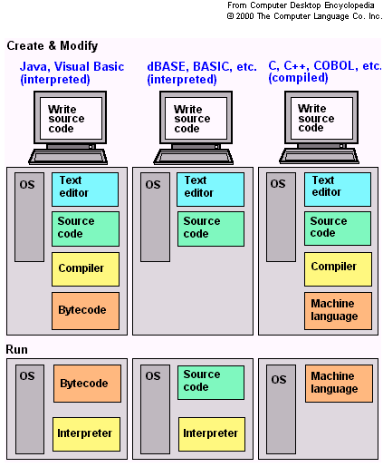
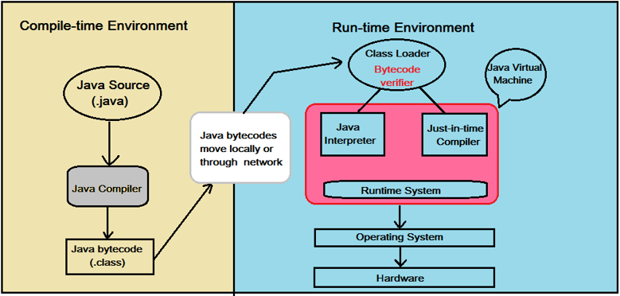
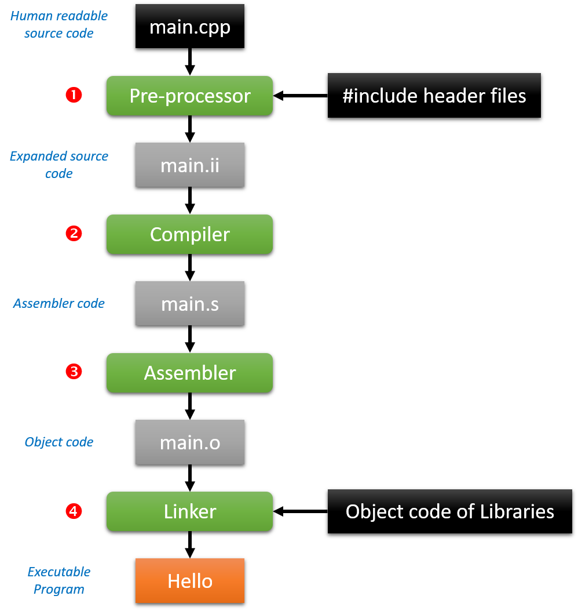

[TOC]

[TODO] Creating hello world, compiling it, makefiles, cross-compilation

# Compiling and Makefiles


## Compilers and Interpreters

We generally write a computer program using a high-level language. A high-level language is one which is understandable by us humans. It contains words and phrases from the English (or other) language. But a computer does not understand high-level language. It only understands program written in 0's and 1's in binary, called the machine code. A program written in high-level language is called a source code. We need to convert the source code into machine code and this is accomplished by compilers and interpreters. Hence, a compiler or an interpreter is a program that converts program written in high-level language into machine code understood by the computer.

In computer science, an interpreter is a computer program that directly executes, i.e. performs, instructions written in a programming or scripting language, without previously compiling them into a machine language program. An interpreter generally uses one of the following strategies for program execution:

* parse the source code and perform its behavior directly.
* translate source code into some efficient intermediate representation and immediately execute this.
* explicitly execute stored precompiled code made by a compiler which is part of the interpreter system.

While interpretation and compilation are the two main means by which programming languages are implemented, they are not mutually exclusive, as most interpreting systems also perform some translation work, just like compilers.


!!! note "Just-in-time compilation"
	Further blurring the distinction between interpreters, byte-code interpreters and compilation is just-in-time compilation (JIT), a technique in which the intermediate representation is compiled to native machine code at runtime. This confers the efficiency of running native code, at the cost of startup time and increased memory use when the bytecode or AST is first compiled. Adaptive optimization is a complementary technique in which the interpreter profiles the running program and compiles its most frequently executed parts into native code. Both techniques are a few decades old, appearing in languages such as Smalltalk in the 1980s.

	Just-in-time compilation has gained mainstream attention amongst language implementers in recent years, with Java, the .NET Framework, most modern JavaScript implementations, and Matlab now including JITs.


| Compiler | Interpreter|
|----------|------------|
| Compiler works on the complete program at once. It takes the entire program as input. | Interpreter program works line-by-line. It takes one statement at a time as input.|
| Compiler generates intermediate code, called the object code or machine code. | Interpreter does not generate intermediate object code or machine code. |
| Compiler executes conditional control statements (like if-else and switch-case) and logical constructs faster than interpreter. | Interpreter execute conditional control statements at a much slower speed. |
| Compiled programs take more memory because the entire object code has to reside in memory. | Interpreter does not generate intermediate object code. As a result, interpreted programs are more memory efficient. |
| Compile once and run anytime. Compiled program does not need to be compiled every time. | Interpreted programs are interpreted line-by-line every time they are run. |
| Errors are reported after the entire program is checked for syntactical  and other errors. | Error is reported as soon as the first error is encountered. Rest of the program will not be checked until the existing error is removed. |
| A compiled language is more difficult to debug. | Debugging is easy because interpreter stops and reports errors as it encounters them. |
| Compiler does not allow a program to run until it is completely error-free. | Interpreter runs the program from first line and stops execution only if it encounters an error. |
| Compiled languages are more efficient but difficult to debug. | Interpreted languages are less efficient but easier to debug. This makes such languages an ideal choice for new students. |
| Examples of programming languages that use compilers: C,  C++, COBOL | Examples of programming languages that use interpreters: BASIC, Visual Basic, Python, Ruby, PHP, Perl, MATLAB, Lisp |


:   Compilers vs Interpreters

### Java is Both a Compiled and Interpreted Language

Java is both a compiled and interpreted language. When you write a Java program, the javac compiler converts your program into something called bytecode. All the Java programs run inside a JVM (Java Virtual Machine; the secret behind Java being cross-platform language). Bytecode compiled by javac, enters into JVM memory and there it is interpreted by another program called java. This java program interprets bytecode line-by-line and converts it into machine code to be run by the JVM. Following flowchart shows how a Java program executes.


:   Java is Both a Compiled and Interpreted Language


## The C++ Compilation Process

Compiling a C++ source code file into an executable program is a four-step process. For example, if you have a C++ source code file named main.cpp and you execute the following compile command:

```shell
g++ -Wall -o Hello main.cpp -save-temps
```

`-Wall` tells the compiler to show ALL warnings as they may describe possible errors in your source code. If warnings are the only messages you get when you compile your source code, an executable will still be created. However it is good practice to fix the code to get no warnings or errors at all.

`-save-temps` tells the compiler to save all intermediate files to the compilation folder (pre-processed files, object files, ...).

In the example above the compilation process looks like this:

1. The C++ preprocessor copies the contents of the included header files into the source code file, generates macro code, and replaces symbolic constants defined using #define with their values. The output of this step is a "pure" C++ file without any pre-processor directives (start with a #). It also adds special markers that tell the compiler where each line came from so that these can be used to produce sensible error messages. The "pure" source code files can be really huge. Even a simple hello world program is transformed into a file with about 11'000 lines of code.

2. The expanded source code file produced by the C++ pre-processor is compiled into the assembly language for the platform.

3. The assembler code generated by the compiler is assembled into the object code for the platform. Object files can refer to symbols that are not defined. This is the case when you use a declaration, and don't provide a definition for it. The compiler doesn't mind this, and will happily produce the object file as long as the source code is well-formed. Compilers usually let you stop compilation at this point. This is very useful because with it you can compile each source code file separately. The advantage this provides is that you don't need to recompile everything if you only change a single file.

4. The object code file generated by the assembler is linked together with the object code files for any library functions used to produce an executable file. It links all the object files by replacing the references to undefined symbols with the correct addresses. Each of these symbols can be defined in other object files or in libraries. If they are defined in libraries other than the standard library, you need to tell the linker about them. The output of the linker can be either a dynamic library or an executable.


:   The Compilation Process of a C++ Program


## Difference between GCC and G++

gcc and g++ are compiler-drivers of the 'GNU Compiler Collection' (which was once upon a time just the 'GNU C Compiler', but it eventually changed when more languages were added.).

!!! note "GNU"
	GNU is an operating system and an extensive collection of computer software. GNU is composed wholly of free software, most of which is licensed under GNU's own GPL (General Purpose License).

	GNU is a recursive acronym for "GNU's Not Unix!", chosen because GNU's design is Unix-like, but differs from Unix by being free software and containing no Unix code. The GNU project includes an operating system kernel, GNU HURD, which was the original focus of the Free Software Foundation (FSF). However, non-GNU kernels, most famously Linux, can also be used with GNU software; and since the kernel is the least mature part of GNU, this is how it is usually used. The combination of GNU software and the Linux kernel is commonly known as Linux (or less frequently GNU/Linux).

The programs gcc and g++ are not compilers, but really drivers that call other programs depending on what arguments you provide to them. These other programs include macro pre-processors (such as cpp), compilers (such as cc1), linkers (such as ld) and assemblers (such as as), as well as others, most of which are part of the GNU Compiler Collection (some are assumed to be on your system).

The actual compiler is "cc1" for C and "cc1plus" for C++.

Even though they automatically determine which compiler to call depending on the file-type, unless overridden with -x language, they have some differences.

The probably most important difference in their defaults is which libraries they link against automatically.

The main differences:

* gcc will compile: .c/.cpp files as C and C++ respectively.
* g++ will compile: .c/.cpp files but they will all be treated as C++ files.
* Also if you use g++ to link the object files it automatically links in the std C++ libraries (gcc does not do this).
* gcc compiling C files has less predefined macros.
* gcc compiling .cpp and g++ compiling .c/.cpp files has a few extra macros.

g++ is equivalent to `gcc -xc++ -lstdc++ -shared-libgcc` (the 1st is a compiler option, the 2nd two are linker options). 

A simple hello world example:

```cpp
// main.cpp
#include <stdio.h>
#include <string>

int main(void) {
  std::string hello = "Hello Universe from the Embedded World!\r\n";
  printf("%s", hello.c_str());

  return 0;
}
```

Compiling this with g++ results a fine working program:

```shell
pi@HAL:~/test_gcc_g++$ g++ main.cpp
pi@HAL:~/test_gcc_g++$ ls
a.out  main.cpp
pi@HAL:~/test_gcc_g++$ ./a.out
Hello Universe from the Embedded World!
```

Trying to do the same with gcc results in linking errors:

```shell
pi@HAL:~/test_gcc_g++$ gcc main.cpp
/tmp/cc7ZE8lV.o: In function `main':
main.cpp:(.text+0x20): undefined reference to `std::allocator<char>::allocator()'
main.cpp:(.text+0x35): undefined reference to `std::__cxx11::basic_string<char, std::char_traits<char>, std::allocator<char> >::basic_string(char const*, std::allocator<char> const&)'
main.cpp:(.text+0x41): undefined reference to `std::allocator<char>::~allocator()'
main.cpp:(.text+0x4d): undefined reference to `std::__cxx11::basic_string<char, std::char_traits<char>, std::allocator<char> >::c_str() const'
main.cpp:(.text+0x70): undefined reference to `std::__cxx11::basic_string<char, std::char_traits<char>, std::allocator<char> >::~basic_string()'
main.cpp:(.text+0x92): undefined reference to `std::allocator<char>::~allocator()'
main.cpp:(.text+0xac): undefined reference to `std::__cxx11::basic_string<char, std::char_traits<char>, std::allocator<char> >::~basic_string()'
/tmp/cc7ZE8lV.o:(.eh_frame+0x13): undefined reference to `__gxx_personality_v0'
collect2: error: ld returned 1 exit status
```

However if we repeat the command but inform the linker to link in the standard C++ libraries all is well:

```shell
pi@HAL:~/test_gcc_g++$ gcc main.cpp -lstdc++
pi@HAL:~/test_gcc_g++$ ls
a.out  main.cpp
pi@HAL:~/test_gcc_g++$ ./a.out
Hello Universe from the Embedded World!
```

Conclusion: don't make your life more complex than needed and use g++ to compile your C++ and C programs.

### Embedded Systems Compilers

But wait, how do you build a compiler if you do not have a compiler?

Generally, when new platforms (architectures and/or operating systems) are released they come with a native compiler which may not be as powerful as the GCC ones but can compile basic C programs with minimal or no optimization. The default C compiler on a new system is often named cc. When GCC is ported to a new platform, this default compiler is used to build GCC which can then be used to build other applications on top of it.

As a configuration such as a Linux OS on an Intel x86 machine is pretty common, it is likely that the system comes with a pre-built GCC suite with the program cc simply linking to gcc.